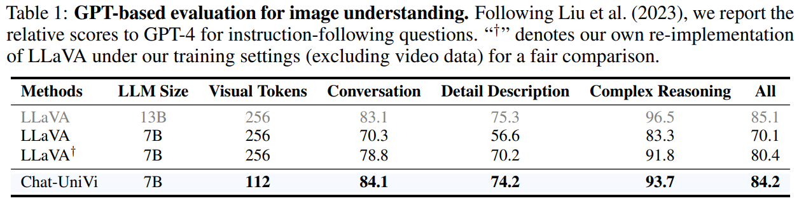
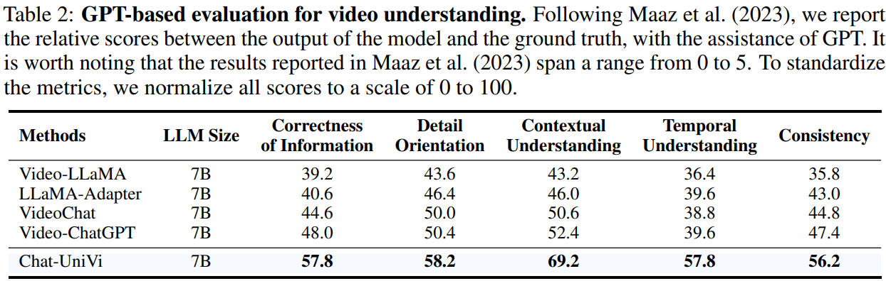
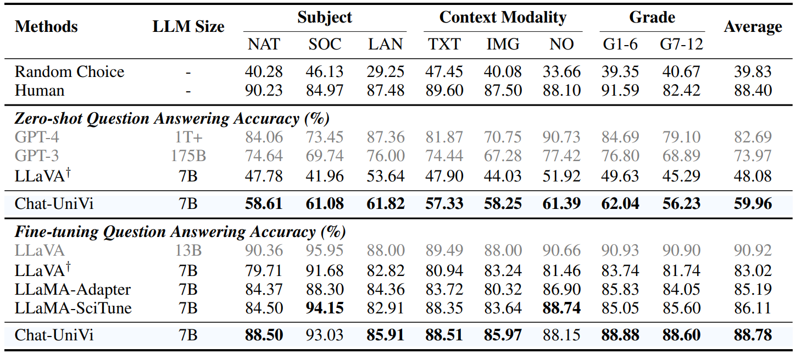

<div align=center>

</div>

<h2 align="center"> <a href="https://arxiv.org/abs/2311.08046">Chat-UniVi: Unified Visual Representation Empowers Large Language Models with Image and Video Understanding</a></h2>
<h5 align="center"> If you like our project, please give us a star ⭐ on GitHub for the latest update.</h5>

<h5 align=center>
  
[](https://huggingface.co/Chat-UniVi)
[](https://arxiv.org/abs/2311.08046)
[](https://github.com/PKU-YuanGroup/Chat-UniVi/blob/main/LICENSE)
[](https://hits.seeyoufarm.com)
[](https://github.com/PKU-YuanGroup/Chat-UniVi/issues?q=is%3Aopen+is%3Aissue)
[](https://github.com/PKU-YuanGroup/Chat-UniVi/issues?q=is%3Aissue+is%3Aclosed)
</h5>

## 📣 News
* **[2023/11/15]**  Code are available now! Welcome to **watch** 👀 this repository for the latest updates.

## 😮 Highlights

### 💡 Unified visual representation for image and video
We employ **a set of dynamic visual tokens** to uniformly represent images and videos.
This representation framework empowers the model to efficiently utilize **a limited number of visual tokens** to simultaneously capture **the spatial details necessary for images** and **the comprehensive temporal relationship required for videos**.

<div align=center>

</div>

### 🔥 Joint training strategy, making LLMs understand both image and video
Chat-UniVi is trained on a mixed dataset containing both images and videos, allowing direct application to tasks involving both mediums without requiring any modifications.

<div align=center>

</div>

### 🤗 High performance, complementary learning with image and video
Extensive experimental results demonstrate that Chat-UniVi, as a unified model, consistently outperforms even existing methods exclusively designed for either images or videos.

<div align=center>

</div>

## ⚡ Demo
Please change the model path on line 15 of the main_demo.py first. Then run the demo:

```
# Line 15 of main_demo.py
model_path = [model path]

CUDA_VISIBLE_DEVICES=0 uvicorn main_demo:app --host 0.0.0.0 --port 8888
```

### A conversation with both image and video
<div align=center>

</div>

### A conversation includes multiple videos
<div align=center>

</div>

### A conversation includes multiple images
<div align=center>

</div>

### A conversation includes the video
<div align=center>

</div>

### A conversation in Chinese
With translation API, our model can also support Chinese conversations. We will add code to support Chinese conversations in future updates.

<div align=center>

</div>

## 🚀 Main Results
### Image understanding
Following LLaVA, we report the relative scores to GPT-4 for instruction-following questions.

<div align=center>

</div>

### Video understanding
Following Video-ChatGPT, we report the relative scores between the output of the model and the ground truth, with the assistance of GPT. It is worth noting that the results reported in Video-ChatGPT span a range from 0 to 5. To standardize the metrics, we normalize all scores to a scale of 0 to 100.

<div align=center>

</div>

### ScienceQA
We report both zero-shot and fine-tuning results on the ScienceQA test set. 

<div align=center>

</div>

### VideoQA
We follow the evaluation protocol in Video-ChatGPT, i.e., employing GPT-assisted evaluation to assess the capabilities of models.

<div align=center>

</div>

### Hallucination Evaluation
Our model also achieves impressive results in the object hallucination benchmark.

<div align=center>

</div>

## 😍 Visualization
### Visualization for the image inputs
<div align=center>

</div>

### Visualization for the video inputs
<div align=center>

</div>

## 🛠️ Requirements and Installation
* Python >= 3.10
* Install required packages:
```bash
git clone https://github.com/PKU-YuanGroup/Chat-UniVi
cd Chat-UniVi
conda create -n chatunivi python=3.10 -y
conda activate chatunivi
pip install --upgrade pip
pip install -e .
pip install ninja
pip install flash-attn --no-build-isolation
```

## 🤖 API
**We open source all modalities preprocessing code.** If you want to load the model from the model hub on Hugging Face or on local, you can use the following code snippets.


## 🗝️ Training & Validating
* The data instruction is in [DATA.md](DATA.md).
* The training instruction is in [TRAIN_AND_VALIDATE.md](TRAIN_AND_VALIDATE.md).

## 👍 Acknowledgement
* [LLaVA](https://github.com/haotian-liu/LLaVA) The codebase we built upon and it is an efficient large language and vision assistant.
* [Video-ChatGPT](https://github.com/mbzuai-oryx/Video-ChatGPT) Great job contributing the evaluation code and dataset.


## 🔒 License
* The majority of this project is released under the Apache 2.0 license as found in the [LICENSE](https://github.com/PKU-YuanGroup/Chat-UniVi/blob/main/LICENSE) file.
* The service is a research preview intended for non-commercial use only, subject to the model [License](https://github.com/facebookresearch/llama/blob/main/MODEL_CARD.md) of LLaMA, [Terms of Use](https://openai.com/policies/terms-of-use) of the data generated by OpenAI, and [Privacy Practices](https://chrome.google.com/webstore/detail/sharegpt-share-your-chatg/daiacboceoaocpibfodeljbdfacokfjb) of ShareGPT. Please contact us if you find any potential violations.

## ✏️ Citation
If you find this paper useful, please consider staring 🌟 this repo and citing 📑 our paper:
```
@article{jin2023chatunivi,
  title={Chat-UniVi: Unified Visual Representation Empowers Large Language Models with Image and Video Understanding}, 
  author={Peng Jin and Ryuichi Takanobu and Caiwan Zhang and Xiaochun Cao and Li Yuan},
  journal={arXiv preprint arXiv:2311.08046},
  year={2023}
}
```
