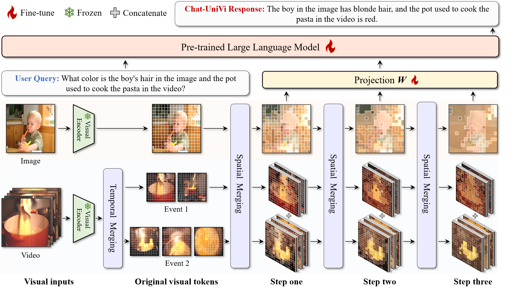
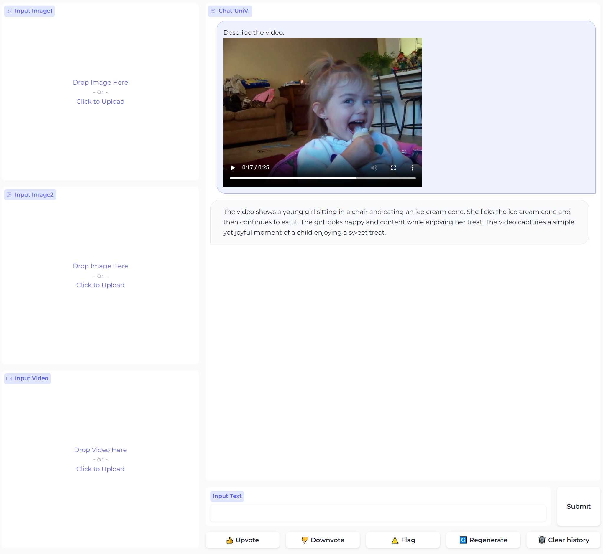
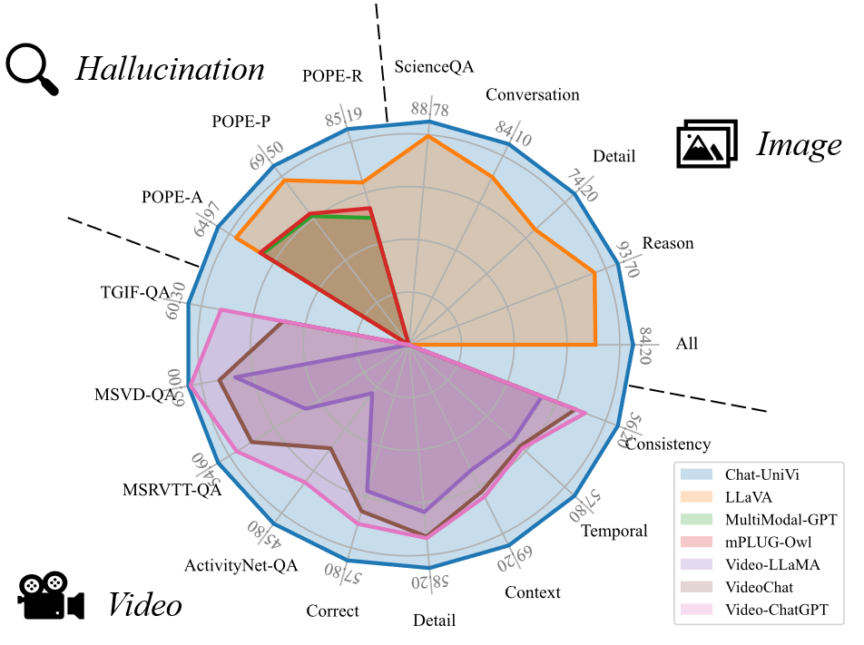
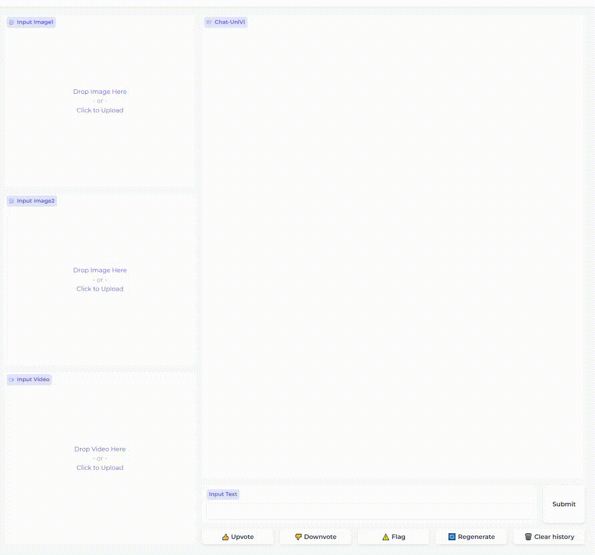
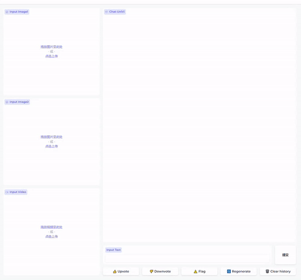
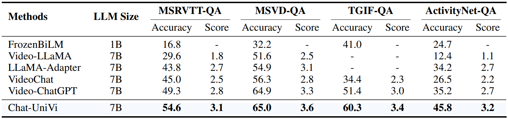
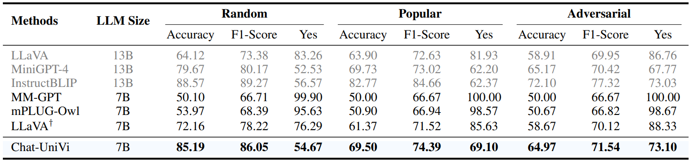
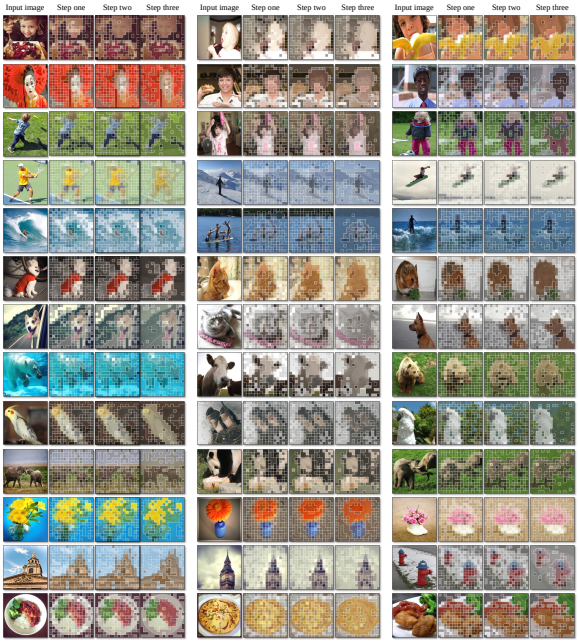
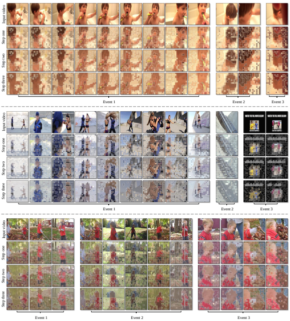

<div align=center>

</div>

<h2 align="center"> <a href="https://arxiv.org/abs/2311.08046">Chat-UniVi: Unified Visual Representation Empowers Large Language Models with Image and Video Understanding</a></h2>
<h5 align="center"> If you like our project, please give us a star ⭐ on GitHub for the latest update.</h5>

<h5 align=center>

[](https://huggingface.co/spaces/Chat-UniVi/Chat-UniVi)
[](https://huggingface.co/Chat-UniVi)
[](https://arxiv.org/abs/2311.08046)
[](https://github.com/PKU-YuanGroup/Chat-UniVi/blob/main/LICENSE)
[](https://hits.seeyoufarm.com)
[](https://github.com/PKU-YuanGroup/Chat-UniVi/issues?q=is%3Aopen+is%3Aissue)
[](https://github.com/PKU-YuanGroup/Chat-UniVi/issues?q=is%3Aissue+is%3Aclosed)
</h5>

## 📣 News
* **[2023/11/22]**  The processed data is available at [DATA.md](DATA.md).
* **[2023/11/21]**  💡We release [Chat-UniVi-13B](https://huggingface.co/Chat-UniVi/Chat-UniVi-13B/tree/main). Our proposed unified visual representation framework greatly reduces the number of visual tokens, so you can train **13B unified image and video understanding models** in full parameters directly on **8 A100 GPUs** within **3 days**. Chat-UniVi-13B has better performance ([Results](https://github.com/PKU-YuanGroup/Chat-UniVi/blob/main/results/Chat-UniVi-13B.md)). The training code for Chat-UniVi-13B has been updated ([TRAIN_AND_VALIDATE.md](TRAIN_AND_VALIDATE.md)).
* **[2023/11/21]**  We provide inference code for [video understanding](https://github.com/PKU-YuanGroup/Chat-UniVi/tree/main#inference-for-video-understanding) and [image understanding](https://github.com/PKU-YuanGroup/Chat-UniVi/tree/main#inference-for-image-understanding).
* **[2023/11/21]**  We enhance the video loading code by [introducing support for variable-length videos](https://github.com/PKU-YuanGroup/Chat-UniVi/blob/d216cb52bff5ebf6e41eaa56d07a85568e294651/ChatUniVi/eval/model_video_general.py#L29). This improvement involves eliminating the previous zero-filling operation on the video. We find that this updated video loading method significantly boosts performance. Stay tuned for the latest performance updates.
* **[2023/11/15]**  Code are available now! Welcome to **watch** 👀 this repository for the latest updates.

## 😮 Highlights

### 💡 Unified visual representation for image and video
We employ **a set of dynamic visual tokens** to uniformly represent images and videos.
This representation framework empowers the model to efficiently utilize **a limited number of visual tokens** to simultaneously capture **the spatial details necessary for images** and **the comprehensive temporal relationship required for videos**.

<div align=center>

</div>

### 🔥 Joint training strategy, making LLMs understand both image and video
Chat-UniVi is trained on a mixed dataset containing both images and videos, allowing direct application to tasks involving both mediums without requiring any modifications.

<div align=center>

</div>

### 🤗 High performance, complementary learning with image and video
Extensive experimental results demonstrate that Chat-UniVi, as a unified model, consistently outperforms even existing methods exclusively designed for either images or videos.

<div align=center>

</div>

## ⚡ Demo
Please change the model path on line 15 of the main_demo.py first. Then run the demo:

```
# For Chat-UniVi-7B
CUDA_VISIBLE_DEVICES=0 uvicorn main_demo_7B:app --host 0.0.0.0 --port 8888

# For Chat-UniVi-13B
CUDA_VISIBLE_DEVICES=0 uvicorn main_demo_13B:app --host 0.0.0.0 --port 8888
```

### A conversation with both image and video
<div align=center>

</div>

### A conversation includes multiple videos
<div align=center>

</div>

### A conversation includes multiple images
<div align=center>

</div>

### A conversation includes the video
<div align=center>

</div>

### A conversation in Chinese
With translation API, our model can also support Chinese conversations. We will add code to support Chinese conversations in future updates.

<div align=center>

</div>

## 🚀 Main Results
### Image understanding
Following LLaVA, we report the relative scores to GPT-4 for instruction-following questions.

<div align="center">
<table border="1" width="100%">
    <tr align="center">
        <th>Methods</th><th>LLM</th><th>Conversation</th><th>Detail Description</th><th>Complex Reasoning</th><th>All</th>
    </tr>
    <tr align="center">
        <td><a href="https://huggingface.co/Chat-UniVi/Chat-UniVi">Chat-UniVi-7B</a></td><td><a href="https://huggingface.co/lmsys/vicuna-7b-v1.5">Vicuna-7B</a></td><td><b>84.1</b></td><td>74.2</td><td>93.7</td><td>84.2</td>
    </tr>
    </tr>
    <tr align="center">
        <td><a href="https://huggingface.co/Chat-UniVi/Chat-UniVi-13B">Chat-UniVi-13B</a></td><td><a href="https://huggingface.co/lmsys/vicuna-13b-v1.5">Vicuna-13B</a></td><td><b>84.1</b></td><td><b>79.4</b></td><td><b>94.7</b></td><td><b>86.1</b></td>
    </tr>
</table>
</div>


### Video understanding
Following Video-ChatGPT, we report the relative scores between the output of the model and the ground truth, with the assistance of GPT. It is worth noting that the results reported in Video-ChatGPT span a range from 0 to 5. To standardize the metrics, we normalize all scores to a scale of 0 to 100.

<div align="center">
<table border="1" width="100%">
    <tr align="center">
        <th>Methods</th><th>LLM</th><th>Correct</th><th>Detail</th><th>Context</th><th>Temporal</th><th>Consistency</th>
    </tr>
    <tr align="center">
        <td><a href="https://huggingface.co/Chat-UniVi/Chat-UniVi">Chat-UniVi-7B</a></td><td><a href="https://huggingface.co/lmsys/vicuna-7b-v1.5">Vicuna-7B</a></td><td>57.8</td><td>58.2</td><td>69.2</td><td>57.8</td><td>56.2</td>
    </tr>
    </tr>
    <tr align="center">
        <td><a href="https://huggingface.co/Chat-UniVi/Chat-UniVi-13B">Chat-UniVi-13B</a></td><td><a href="https://huggingface.co/lmsys/vicuna-13b-v1.5">Vicuna-13B</a></td><td><b>59.4</b></td><td><b>59.8</b></td><td><b>70.5</b></td><td><b>58.0</b></td><td><b>60.6</b></td>
    </tr>
</table>
</div>

### ScienceQA
We report both zero-shot and fine-tuning results on the ScienceQA test set. 

<div align="center">
<table border="1" width="100%">
    <tr align="center">
        <th>Methods</th><th>LLM</th><th>Average</th><th>Subject</th><th></th><th></th><th>Context Modality</th><th></th><th></th><th>Grade</th><th></th>
    </tr>
    <tr align="center">
        <th></th><th></th><th></th><th>NAT</th><th>SOC</th><th>LAN</th><th>TXT</th><th>IMG</th><th>NO</th><th>G1-6</th><th>G7-12</th>
    </tr>
    <tr align="center">
        <td><a href="https://huggingface.co/Chat-UniVi/Chat-UniVi">Chat-UniVi-7B</a></td><td><a href="https://huggingface.co/lmsys/vicuna-7b-v1.5">Vicuna-7B</a></td><td>88.78</td><td>88.50</td><td>93.03</td><td>85.91</td><td>88.51</td><td>85.97</td><td>88.15</td><td>88.88</td><td>88.60</td>
    </tr>
    </tr>
    <tr align="center">
        <td><a href="https://huggingface.co/Chat-UniVi/Chat-UniVi-13B">Chat-UniVi-13B</a></td><td><a href="https://huggingface.co/lmsys/vicuna-13b-v1.5">Vicuna-13B</a></td><td><b>90.99</b></td><td><b>90.41</b></td><td><b>95.05</b></td><td><b>88.91</b></td><td><b>89.64</b></td><td><b>88.05</b></td><td><b>90.94</b></td><td><b>91.19</b></td><td><b>90.64</b></td>
    </tr>
</table>
</div>

### VideoQA
We follow the evaluation protocol in Video-ChatGPT, i.e., employing GPT-assisted evaluation to assess the capabilities of models.

<div align=center>

</div>

### Hallucination Evaluation (POPE)
Our model also achieves impressive results in the object hallucination benchmark.

<div align=center>

</div>

## 😍 Visualization
### Visualization for the image inputs
<div align=center>

</div>

### Visualization for the video inputs
<div align=center>

</div>

## 🛠️ Requirements and Installation
* Python >= 3.10
* Install required packages:
```bash
git clone https://github.com/PKU-YuanGroup/Chat-UniVi
cd Chat-UniVi
conda create -n chatunivi python=3.10 -y
conda activate chatunivi
pip install --upgrade pip
pip install -e .
pip install ninja
pip install flash-attn --no-build-isolation
```
## 🤖 API
**We open source all modalities preprocessing code.** If you want to load the model from the model hub on Hugging Face or on local, you can use the following code snippets.

### Inference for Video Understanding
```python
import torch
import os
from ChatUniVi.constants import *
from ChatUniVi.conversation import conv_templates, SeparatorStyle
from ChatUniVi.model.builder import load_pretrained_model
from ChatUniVi.utils import disable_torch_init
from ChatUniVi.mm_utils import tokenizer_image_token, get_model_name_from_path, KeywordsStoppingCriteria
from PIL import Image
from decord import VideoReader, cpu
import numpy as np


def _get_rawvideo_dec(video_path, image_processor, max_frames=MAX_IMAGE_LENGTH, image_resolution=224, video_framerate=1, s=None, e=None):
    # speed up video decode via decord.
    video_mask = np.zeros(max_frames, dtype=np.int64)
    max_video_length = 0

    # T x 3 x H x W
    video = np.zeros((max_frames, 3, image_resolution, image_resolution), dtype=np.float64)

    if s is None:
        start_time, end_time = None, None
    else:
        start_time = int(s)
        end_time = int(e)
        start_time = start_time if start_time >= 0. else 0.
        end_time = end_time if end_time >= 0. else 0.
        if start_time > end_time:
            start_time, end_time = end_time, start_time
        elif start_time == end_time:
            end_time = start_time + 1

    if os.path.exists(video_path):
        vreader = VideoReader(video_path, ctx=cpu(0))
    else:
        print(video_path)
        raise FileNotFoundError

    fps = vreader.get_avg_fps()
    f_start = 0 if start_time is None else int(start_time * fps)
    f_end = int(min(1000000000 if end_time is None else end_time * fps, len(vreader) - 1))
    num_frames = f_end - f_start + 1
    if num_frames > 0:
        # T x 3 x H x W
        sample_fps = int(video_framerate)
        t_stride = int(round(float(fps) / sample_fps))

        all_pos = list(range(f_start, f_end + 1, t_stride))
        if len(all_pos) > max_frames:
            sample_pos = [all_pos[_] for _ in np.linspace(0, len(all_pos) - 1, num=max_frames, dtype=int)]
        else:
            sample_pos = all_pos

        patch_images = [Image.fromarray(f) for f in vreader.get_batch(sample_pos).asnumpy()]

        patch_images = torch.stack([image_processor.preprocess(img, return_tensors='pt')['pixel_values'][0] for img in patch_images])
        slice_len = patch_images.shape[0]

        max_video_length = max_video_length if max_video_length > slice_len else slice_len
        if slice_len < 1:
            pass
        else:
            video[:slice_len, ...] = patch_images

        return patch_images, video_mask
    else:
        print("video path: {} error.".format(video_path))

    video_mask[:max_video_length] = [1] * max_video_length

    return torch.from_numpy(video), video_mask

if __name__ == '__main__':
    # Model Parameter
    model_path = "Chat-UniVi/Chat-UniVi"  # or "Chat-UniVi/Chat-UniVi-13B"
    video_path = ${video_path}
    max_frames = ${max_frames}

    # Input Text
    qs = "Describe the video."

    # Sampling Parameter
    conv_mode = "simple"
    temperature = 0.2
    top_p = None
    num_beams = 1

    disable_torch_init()
    model_path = os.path.expanduser(model_path)
    model_name = "ChatUniVi"
    tokenizer, model, image_processor, context_len = load_pretrained_model(model_path, None, model_name)

    mm_use_im_start_end = getattr(model.config, "mm_use_im_start_end", False)
    mm_use_im_patch_token = getattr(model.config, "mm_use_im_patch_token", True)
    if mm_use_im_patch_token:
        tokenizer.add_tokens([DEFAULT_IMAGE_PATCH_TOKEN], special_tokens=True)
    if mm_use_im_start_end:
        tokenizer.add_tokens([DEFAULT_IM_START_TOKEN, DEFAULT_IM_END_TOKEN], special_tokens=True)
    model.resize_token_embeddings(len(tokenizer))

    vision_tower = model.get_vision_tower()
    if not vision_tower.is_loaded:
        vision_tower.load_model()
    image_processor = vision_tower.image_processor

    if model.config.config["use_cluster"]:
        for n, m in model.named_modules():
            m = m.to(dtype=torch.bfloat16)

    # Check if the video exists
    if video_path is not None:
        video_frames, _ = _get_rawvideo_dec(video_path, image_processor, max_frames=max_frames)

        cur_prompt = qs
        if model.config.mm_use_im_start_end:
            qs = DEFAULT_IM_START_TOKEN + DEFAULT_IMAGE_TOKEN * MAX_IMAGE_LENGTH + DEFAULT_IM_END_TOKEN + '\n' + qs
        else:
            qs = DEFAULT_IMAGE_TOKEN * MAX_IMAGE_LENGTH + '\n' + qs

        conv = conv_templates[conv_mode].copy()
        conv.append_message(conv.roles[0], qs)
        conv.append_message(conv.roles[1], None)
        prompt = conv.get_prompt()

        input_ids = tokenizer_image_token(prompt, tokenizer, IMAGE_TOKEN_INDEX, return_tensors='pt').unsqueeze(
            0).cuda()

        stop_str = conv.sep if conv.sep_style != SeparatorStyle.TWO else conv.sep2
        keywords = [stop_str]
        stopping_criteria = KeywordsStoppingCriteria(keywords, tokenizer, input_ids)

        with torch.inference_mode():
            output_ids = model.generate(
                input_ids,
                images=video_frames.half().cuda(),
                do_sample=True,
                temperature=temperature,
                top_p=top_p,
                num_beams=num_beams,
                output_scores=True,
                return_dict_in_generate=True,
                max_new_tokens=1024,
                use_cache=True,
                stopping_criteria=[stopping_criteria])

        output_ids = output_ids.sequences
        input_token_len = input_ids.shape[1]
        n_diff_input_output = (input_ids != output_ids[:, :input_token_len]).sum().item()
        if n_diff_input_output > 0:
            print(f'[Warning] {n_diff_input_output} output_ids are not the same as the input_ids')
        outputs = tokenizer.batch_decode(output_ids[:, input_token_len:], skip_special_tokens=True)[0]
        outputs = outputs.strip()
        if outputs.endswith(stop_str):
            outputs = outputs[:-len(stop_str)]
        outputs = outputs.strip()
        print(outputs)
```

### Inference for Image Understanding
```python
import torch
import os
from ChatUniVi.constants import *
from ChatUniVi.conversation import conv_templates, SeparatorStyle
from ChatUniVi.model.builder import load_pretrained_model
from ChatUniVi.utils import disable_torch_init
from ChatUniVi.mm_utils import tokenizer_image_token, get_model_name_from_path, KeywordsStoppingCriteria
from PIL import Image


if __name__ == '__main__':
    # Model Parameter
    model_path = "Chat-UniVi/Chat-UniVi"  # or "Chat-UniVi/Chat-UniVi-13B"
    image_path = ${image_path}

    # Input Text
    qs = "Describe the image."

    # Sampling Parameter
    conv_mode = "simple"
    temperature = 0.2
    top_p = None
    num_beams = 1

    disable_torch_init()
    model_path = os.path.expanduser(model_path)
    model_name = "ChatUniVi"
    tokenizer, model, image_processor, context_len = load_pretrained_model(model_path, None, model_name)

    mm_use_im_start_end = getattr(model.config, "mm_use_im_start_end", False)
    mm_use_im_patch_token = getattr(model.config, "mm_use_im_patch_token", True)
    if mm_use_im_patch_token:
        tokenizer.add_tokens([DEFAULT_IMAGE_PATCH_TOKEN], special_tokens=True)
    if mm_use_im_start_end:
        tokenizer.add_tokens([DEFAULT_IM_START_TOKEN, DEFAULT_IM_END_TOKEN], special_tokens=True)
    model.resize_token_embeddings(len(tokenizer))

    vision_tower = model.get_vision_tower()
    if not vision_tower.is_loaded:
        vision_tower.load_model()
    image_processor = vision_tower.image_processor

    # Check if the video exists
    if image_path is not None:
        cur_prompt = qs
        if model.config.mm_use_im_start_end:
            qs = DEFAULT_IM_START_TOKEN + DEFAULT_IMAGE_TOKEN + DEFAULT_IM_END_TOKEN + '\n' + qs
        else:
            qs = DEFAULT_IMAGE_TOKEN + '\n' + qs

        conv = conv_templates[conv_mode].copy()
        conv.append_message(conv.roles[0], qs)
        conv.append_message(conv.roles[1], None)
        prompt = conv.get_prompt()

        input_ids = tokenizer_image_token(prompt, tokenizer, IMAGE_TOKEN_INDEX, return_tensors='pt').unsqueeze(0).cuda()

        image = Image.open(image_path)
        image_tensor = image_processor.preprocess(image, return_tensors='pt')['pixel_values'][0]

        stop_str = conv.sep if conv.sep_style != SeparatorStyle.TWO else conv.sep2
        keywords = [stop_str]
        stopping_criteria = KeywordsStoppingCriteria(keywords, tokenizer, input_ids)

        with torch.inference_mode():
            output_ids = model.generate(
                input_ids,
                images=image_tensor.unsqueeze(0).half().cuda(),
                do_sample=True,
                temperature=temperature,
                top_p=top_p,
                num_beams=num_beams,
                max_new_tokens=1024,
                use_cache=True,
                stopping_criteria=[stopping_criteria])

        input_token_len = input_ids.shape[1]
        n_diff_input_output = (input_ids != output_ids[:, :input_token_len]).sum().item()
        if n_diff_input_output > 0:
            print(f'[Warning] {n_diff_input_output} output_ids are not the same as the input_ids')
        outputs = tokenizer.batch_decode(output_ids[:, input_token_len:], skip_special_tokens=True)[0]
        outputs = outputs.strip()
        if outputs.endswith(stop_str):
            outputs = outputs[:-len(stop_str)]
        outputs = outputs.strip()
        print(outputs)
```


## 🗝️ Training & Validating
* The data instruction is in [DATA.md](DATA.md).
* The training instruction is in [TRAIN_AND_VALIDATE.md](TRAIN_AND_VALIDATE.md).

## 👍 Acknowledgement
* [LLaVA](https://github.com/haotian-liu/LLaVA) The codebase we built upon and it is an efficient large language and vision assistant.
* [Video-ChatGPT](https://github.com/mbzuai-oryx/Video-ChatGPT) Great job contributing the evaluation code and dataset.


## 🔒 License
* The majority of this project is released under the Apache 2.0 license as found in the [LICENSE](https://github.com/PKU-YuanGroup/Chat-UniVi/blob/main/LICENSE) file.
* The service is a research preview intended for non-commercial use only, subject to the model [License](https://github.com/facebookresearch/llama/blob/main/MODEL_CARD.md) of LLaMA, [Terms of Use](https://openai.com/policies/terms-of-use) of the data generated by OpenAI, and [Privacy Practices](https://chrome.google.com/webstore/detail/sharegpt-share-your-chatg/daiacboceoaocpibfodeljbdfacokfjb) of ShareGPT. Please contact us if you find any potential violations.

## ✏️ Citation
If you find this paper useful, please consider staring 🌟 this repo and citing 📑 our paper:
```
@article{jin2023chatunivi,
  title={Chat-UniVi: Unified Visual Representation Empowers Large Language Models with Image and Video Understanding}, 
  author={Peng Jin and Ryuichi Takanobu and Caiwan Zhang and Xiaochun Cao and Li Yuan},
  journal={arXiv preprint arXiv:2311.08046},
  year={2023}
}
```
